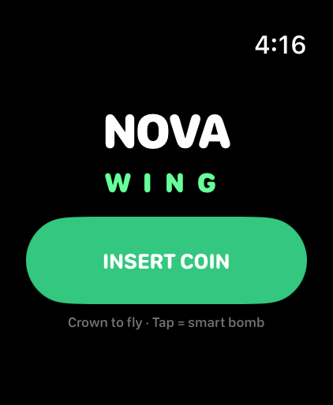
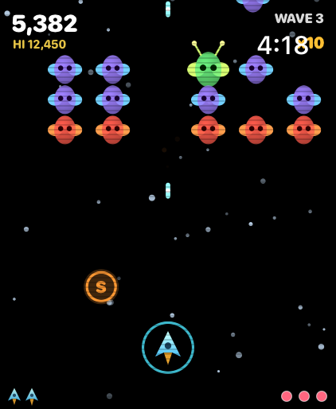
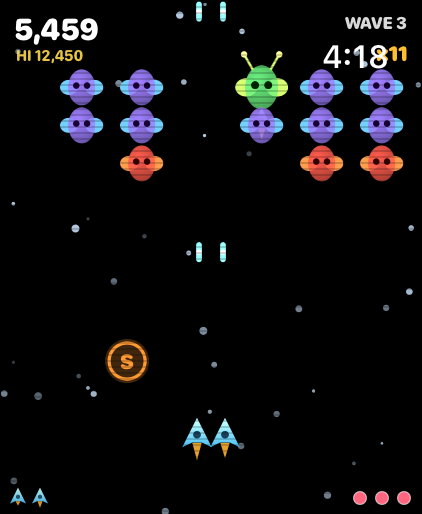
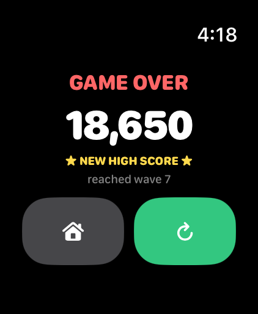

# Nova Wing 🚀

A **Galaga-style arcade space shooter** for **Apple Watch** (built for the Watch
Ultra, runs on watchOS 10+). Glide your fighter with the **Digital Crown**,
auto-blast swarms of swooping invaders, ride the formation fly-ins, survive the
flagship's **capture beam** — then blast it to free a **twin fighter** with double
guns. Escalating waves, challenge stages, power-ups, smart bombs, and a
high-score chase, all wrapped in a CRT-scanline arcade look.

Written entirely in **SwiftUI** — the whole game is drawn in a `Canvas` driven by
a `TimelineView` loop, with Taptic Engine haptics throughout. No companion
iPhone app required.

## Screenshots

_Captured on the Apple Watch Ultra 3 (49mm) simulator._

| Title | Gameplay | Twin fighter | Game over |
|:-----:|:--------:|:------------:|:---------:|
|  |  |  |  |

---

## Controls

| Input | Action |
|-------|--------|
| **Digital Crown** | Fly left / right (your blaster auto-fires) |
| **Tap screen** | Smart bomb — clears enemy fire and damages everything on screen (you carry a few) |

## How it plays

- **Waves** of invaders fly in and lock into a swaying **formation**, then peel
  off in **swooping dive-bomb runs**, firing as they go.
- Three enemy types: **grunts** (red), **escorts** (purple), and the green
  **flagship**.
- **Capture & rescue** — the signature hook: a diving flagship can catch your
  ship in a tractor beam (you lose it). Destroy that flagship while it's holding
  your ship and you get it back as a **twin fighter** with double guns.
- **Power-ups** drop from tougher enemies: **S**pread shot, **R**apid fire,
  shiel**D**, **B**omb +1, and **W**ing (instant twin fighter).
- **Combo multiplier** rewards fast, uninterrupted kills.
- Every **4th wave is a challenge stage** — enemies fly fancy patterns and don't
  shoot back; blast them for bonus points.
- Lives, smart bombs, extra lives at score milestones, and a saved **high score**.

---

## Build & run

Requires **Xcode 16+** (developed on Xcode 26.5 / watchOS 26.5 SDK) on a Mac.

```bash
git clone https://github.com/at0m-b0mb/NovaWing.git
cd NovaWing
open NovaWing.xcodeproj
```

1. Select the **Nova Wing Watch App** scheme.
2. **Simulator:** pick any Apple Watch simulator and press **Run** (⌘R). No watch
   simulators listed? Install a runtime via *Xcode ▸ Settings ▸ Components*.
   - Steer the Crown in the Simulator: click the Digital Crown on the watch's
     right edge, then scroll your mouse wheel / trackpad. Tap the screen to bomb.
3. **Your Apple Watch Ultra:** set your Team under *Signing & Capabilities*
   (needs a paid Apple Developer account to sideload to hardware), pick your
   watch, and Run.

> **If a run ever fails with "Invalid argument" / a missing executable**, do
> *Product ▸ Clean Build Folder* (⇧⌘K) and run again — that's a stale
> incremental-build artifact, not a code problem.

### Command-line build check

```bash
DEVELOPER_DIR=/Applications/Xcode.app/Contents/Developer \
xcodebuild -project NovaWing.xcodeproj -scheme "Nova Wing Watch App" \
  -sdk watchsimulator26.5 -destination 'generic/platform=watchOS Simulator' \
  -derivedDataPath /tmp/NovaWingDD CODE_SIGNING_ALLOWED=NO build
```

---

## Project layout

```
NovaWing/
├─ NovaWing.xcodeproj
├─ Screenshots/                # images used in this README
└─ NovaWingWatchApp/
   ├─ NovaWingApp.swift        # @main entry, owns the GameEngine
   ├─ ContentView.swift        # phase router (menu / play / game over)
   ├─ MenuView.swift           # arcade title + INSERT COIN
   ├─ GamePlayView.swift       # Canvas host: game loop + Crown + tap-to-bomb
   ├─ GameOverView.swift       # result screen, replay / home
   ├─ GameEngine.swift         # the whole simulation — player, waves, enemy AI,
   │                           #   capture mechanic, power-ups, collisions, score
   ├─ NovaRenderer.swift       # stateless arcade drawing of every frame
   ├─ Models.swift             # entities + bezier path math
   ├─ Haptics.swift            # Taptic Engine wrapper (feedback by intent)
   └─ Assets.xcassets          # app icon + accent colour
```

## Tuning

Enemy waves, dive cadence, fire rates, and the capture rules live in
**`GameEngine.swift`** (see `spawnFormation`, `scheduleDive`, `updateCapture`,
and the tunables up top). The whole look — ships, lasers, explosions, HUD,
scanlines — is in **`NovaRenderer.swift`**.

> The screenshots were generated with a **Debug-only** demo hook in
> `GameEngine.swift` (gated behind the `NW_DEMO` launch environment variable and
> compiled out of Release), e.g.
> `SIMCTL_CHILD_NW_DEMO=play xcrun simctl launch booted com.at0mb0mb.novawing`.
